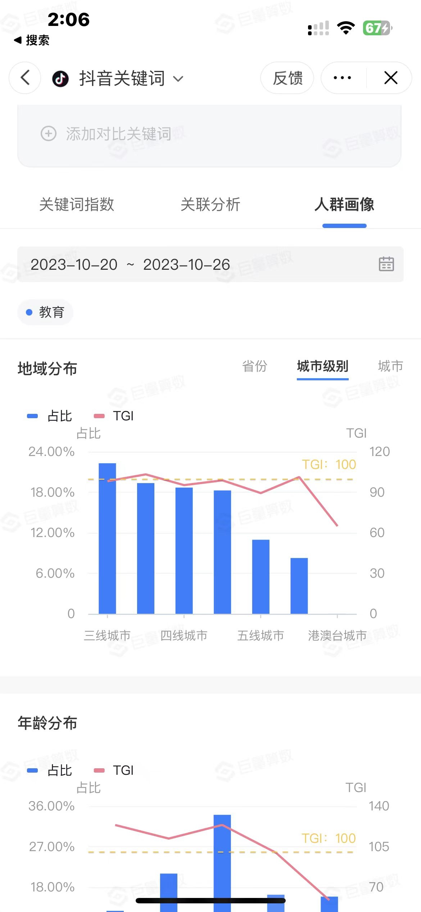
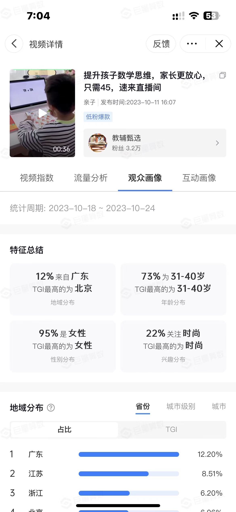

# 文案
从我了解到现在，除了暴力做矩阵之外，其实我意识到一个问题，抖音从17年飞速增长到了现在已经6年时间了，这6年时间里，平台已经不缺所谓的流量了，也就是说过了流量红利期，所以一个好的内容导向能够给你带来的就是平台流量的扶持。

之所以这么认为的原因是，在观察了很多的流量工具上能够得到一个理念：在内容大部分同质化的情况下，低粉爆款已经越来越少了，视频是很难去创作的，内容的创作也是很难的。但是就是因为太难了很多人卡在了这一步。

# 抄

因为做内容太难，所以我们要先抄，在抄的过程中去总结，对方有什么是能够说进你心里的点，有哪些可以更完善。所以需要进行复盘。

不仅仅需要去抄，还要去理解。 所有的生意都可以转私域去进行，那么私域该怎么去维护也是我们要考虑的一大因素。

# 投流

抖音已经过去了增长的时期，现在他的流量已经非常庞大了，他的流量也只是会推给优质内容用户，这样才能吸引留住那些刷抖音的人。如果你的内容不够优质，那么你想推流人家都不想收你这个钱。

那么什么是优质内容？我觉得不管是优质内容还是私域，他有一个很大的本质：**利他**
平台与内容创作方对用户是要尊重的。

只有足够尊重足够利他才会带来结果，而不是一开始就直接奔着结果去的。

# 教育

为什么涉及到教育这一块，一二线城市没有，但是三四五线城市成了主力军？
我个人认为一二线城市的教育体系是不一样的，再加上大家对教育理念的改革，三四五线城市的教育重视程度也拉了起来，或者说三四五线城市的教育一直是长期痛点。

这些主动观看的用户画像里面。绝大多数是女性来进行观看的，在于此同时22%的人关注了时尚，说明目前大家手上是能够为育儿这样一件事情投入金钱的，这也是未来长期存在的一个趋势。

# 初生儿数据

通过对近年来中国出生人口数据的分析，我们发现了以下趋势和数据：

* 在2022年，中国的出生人口为956万。
* 在2021年，出生人口为1062万。
* 自2017年以来，中国的出生人口呈现连续下降的趋势，为期六年。
* 报道显示，近5年内，中国的新生儿人口数量下滑了约40%，预计2023年的出生人口数将在700万至800多万之间。
这些数据揭示了中国出生率的下降趋势，而这一趋势的背后，反映了养育儿童的高成本。尽管如此，家长们对于提供优质教育的需求却是持续增长的。

# 锚点

无论做销售也好还是做平台也好，其实我们的目的也带有销售形式。这些里面有会标注一点：

## 找痒点
为什么一二线城市的家长不怎么操心孩子的教育问题？

- 师生资源好/教育资源好
- 教育氛围好

## 挖痛点

- 为什么他们的师生教育资源好，而我们不好（针对三四线城市而言）
- 为什么他们的教育没有压力？（因为城市人口少，高考分数线录取低）
- 为什么他们的教育氛围好？（因为没有教育压力，而且在一线城市能够接触到最近最前沿的教育方式）

## 制锚点

- 我们该怎么缩小他们的距离？

让家长去思考，再引发共鸣。